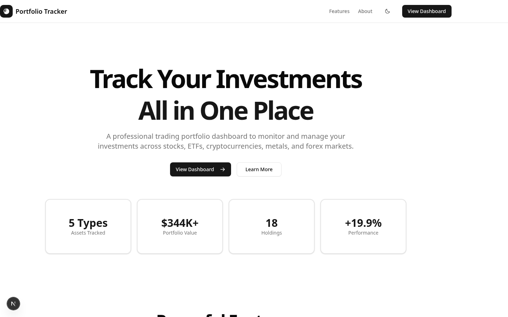
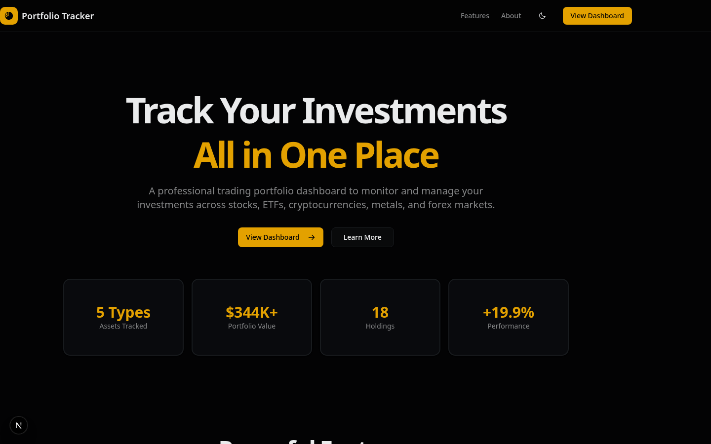
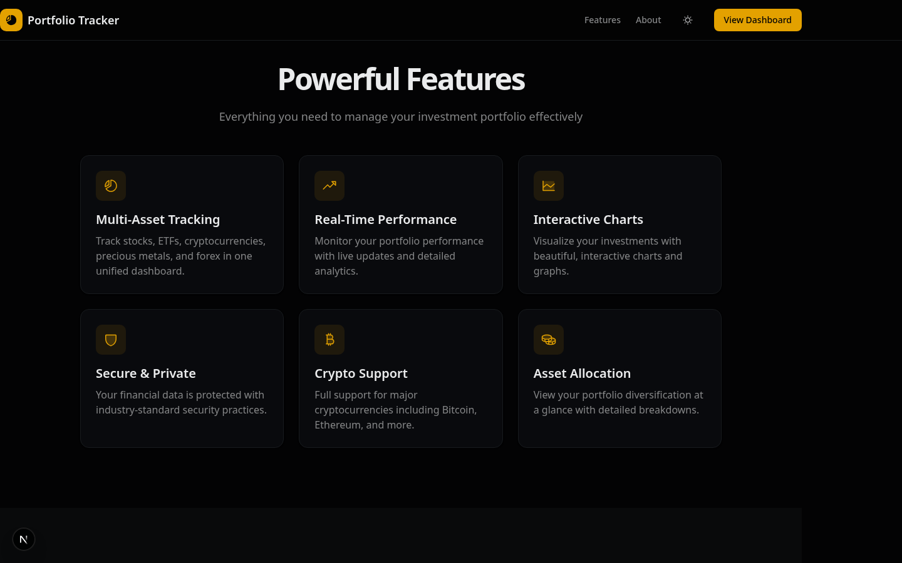
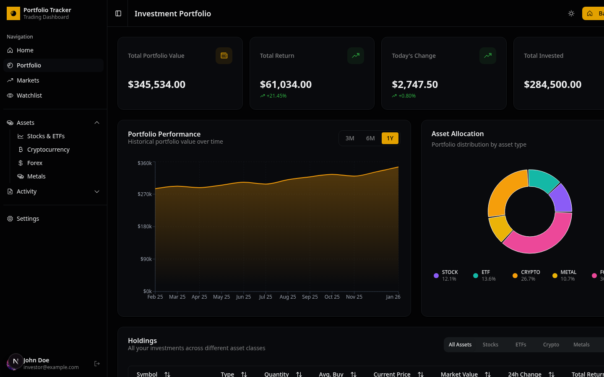

# Trading Portfolio Dashboard

A professional trading portfolio tracker built with Next.js, shadcn/ui, and Recharts. Track stocks, ETFs, cryptocurrencies, precious metals, and forex positions with comprehensive analytics and visualizations.


## Preview

<p align="center">
  
  
</p>

### Component Demos

<p align="center">
  
</p>

### Dashboard

<p align="center">
  
</p>

### Portfolio

<p align="center">
  
</p>

## Features

### Portfolio Management
- **Multi-asset support**: Stocks, ETFs, Cryptocurrencies, Precious Metals, and Forex
- **Real-time metrics**: Portfolio value, daily P&L, total returns, and invested capital
- **18 sample holdings** with comprehensive position tracking

### Analytics & Visualizations
- **Portfolio Performance Chart**: Interactive area chart with 3M/6M/1Y time ranges
- **Asset Allocation**: Donut chart showing distribution across asset classes
- **Holdings Table**: Sortable, filterable table with 8 data columns
- **Trend Indicators**: Color-coded gains/losses with directional arrows

### User Experience
- **Dark/light mode** toggle with system preference detection
- **Fully responsive** design (mobile, tablet, desktop)
- **Professional UI** built with shadcn/ui components
- **Accessible** components following WCAG standards

## Asset Classes

| Asset Class | Examples | Features |
|-------------|----------|----------|
| **Stocks** | AAPL, MSFT, GOOGL, NVDA, TSLA | Individual company equities with real-time tracking |
| **ETFs** | SPY, QQQ, VTI | Diversified index funds for broad market exposure |
| **Cryptocurrencies** | BTC, ETH, SOL, ADA | Digital assets with high volatility tracking |
| **Precious Metals** | Gold, Silver, Palladium | Commodity investments for portfolio diversification |
| **Forex** | EUR/USD, GBP/USD, USD/JPY | Major currency pairs for forex trading |

## Dashboard Overview

The trading dashboard at `/dashboard` provides comprehensive portfolio management:

### Portfolio Metrics
- **Total Portfolio Value** - Real-time aggregated value across all holdings ($335,000+)
- **Total Return** - Dollar amount and percentage gain/loss from invested capital
- **Today's Change** - Daily P&L with trend indicators
- **Total Invested** - Original investment amount across all positions

### Charts & Analytics
- **Portfolio Performance Chart** - Interactive area chart tracking value over time
  - Time range selection: 3 months, 6 months, 1 year
  - Custom tooltips with formatted currency
  - Gradient visualization with gold/amber accent

- **Asset Allocation Chart** - Donut chart showing portfolio distribution
  - Color-coded by asset class (Stocks, ETFs, Crypto, Metals, Forex)
  - Interactive legend with percentages
  - Visual breakdown of diversification

### Holdings Table
- **Comprehensive data columns**: Symbol, Type, Quantity, Avg Buy Price, Current Price, Market Value, 24h Change, Total Return
- **Sorting**: Click any column header to sort data
- **Filtering**: Filter by asset type (All/Stocks/ETFs/Crypto/Metals/Forex)
- **Trend indicators**: Color-coded gains (green ↑) and losses (red ↓)
- **Responsive design**: Adapts table layout for mobile and desktop views

## Additional Pages

### Portfolio Landing Page (`/portfolio`)
A professional portfolio landing page featuring:
- Hero section with gradient title and stats grid
- Services, projects, and testimonials sections
- Contact form with validation
- Fully responsive mobile-first design

## Theme Configuration

| Setting | Value |
|---------|-------|
| Color Scheme | Custom trading theme with gold/amber accents |
| Base Color | Zinc |
| Accent | Gold/Amber (#f59e0b) for charts |
| Font | DM Sans |
| Icons | Phosphor & Lucide React |
| Radius | Default rounded corners |
| Dark Mode | System preference with manual toggle |

## Getting Started

```bash
# Install dependencies
npm install

# Run development server
npm run dev

# Build for production
npm run build

# Start production server
npm start
```

Open [http://localhost:3000](http://localhost:3000) to view the landing page, or navigate to [http://localhost:3000/dashboard](http://localhost:3000/dashboard) for the trading dashboard.

## Project Structure

```
src/
├── app/
│   ├── layout.tsx        # Root layout with theme provider
│   ├── page.tsx          # Main landing page
│   ├── globals.css       # Theme CSS variables
│   ├── dashboard/        # Trading dashboard route
│   │   ├── layout.tsx    # Dashboard layout with sidebar
│   │   └── page.tsx      # Main dashboard page
│   └── portfolio/        # Portfolio landing page route
│       └── page.tsx      # Portfolio landing page
├── components/
│   ├── ui/               # shadcn/ui base components
│   ├── dashboard/        # Trading dashboard components
│   │   ├── portfolio-overview.tsx           # Metric cards
│   │   ├── portfolio-performance-chart.tsx  # Area chart
│   │   ├── asset-allocation-chart.tsx       # Donut chart
│   │   ├── holdings-table.tsx               # Data table
│   │   └── holdings-table-columns.tsx       # Table definitions
│   ├── portfolio/        # Portfolio landing components
│   ├── header.tsx        # Site header with navigation
│   ├── hero.tsx          # Hero section
│   └── footer.tsx        # Site footer
└── lib/
    ├── utils.ts          # Utility functions
    ├── trading-data.ts   # Trading portfolio data & calculations
    └── portfolio-data.tsx # Portfolio page content
```

## Tech Stack

- [Next.js 16](https://nextjs.org/) - React framework with App Router
- [shadcn/ui](https://ui.shadcn.com/) - Headless component library
- [Tailwind CSS](https://tailwindcss.com/) - Utility-first CSS framework
- [Recharts](https://recharts.org/) - Charting library for React
- [TanStack Table](https://tanstack.com/table) - Headless table library
- [Phosphor Icons](https://phosphoricons.com/) & [Lucide React](https://lucide.dev/) - Icon libraries
- [next-themes](https://github.com/pacocoursey/next-themes) - Theme management

## Portfolio Data

The dashboard includes sample trading data with 18 holdings across 5 asset classes:

- **5 Stocks**: AAPL, MSFT, GOOGL, NVDA, TSLA
- **3 ETFs**: SPY, QQQ, VTI
- **4 Cryptocurrencies**: BTC, ETH, SOL, ADA
- **3 Precious Metals**: Gold, Silver, Palladium
- **3 Forex Pairs**: EUR/USD, GBP/USD, USD/JPY

Each holding includes:
- Symbol and full name
- Quantity held
- Average buy price
- Current market price
- 24-hour change (% and $)
- Total return (% and $)

Portfolio calculations include:
- Total portfolio value
- Total invested capital
- Overall return ($ and %)
- Daily P&L
- Asset allocation percentages
- Historical performance data (12 months)

## Key Features

### Real-time Calculations
All metrics are dynamically calculated from the holdings data:
- Portfolio value aggregation
- Return calculations (both 24h and lifetime)
- Asset class distribution
- Performance trending

### Interactive Elements
- Sortable table columns
- Asset type filtering
- Time range selection for charts
- Responsive chart tooltips
- Color-coded trend indicators

### Responsive Design
- Mobile: Single column layout with optimized tables
- Tablet: 2-column metric grid
- Desktop: 4-column metric grid with full-width charts

## License

MIT
