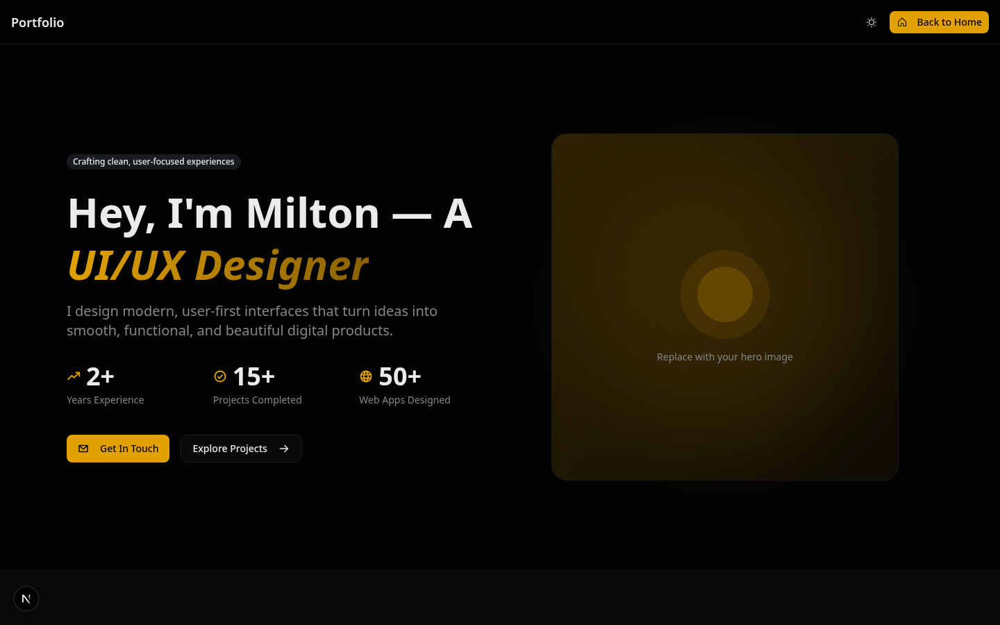

# Portfolio Screenshot Instructions

Please save your portfolio screenshot to the following location:

**File path:** `screenshots/portfolio-ss.png`

The README.md has been updated to reference this screenshot file. Once you save the image file to the screenshots folder, it will automatically appear in the README.

## Steps:

1. Save the portfolio screenshot from your browser/screen capture
2. Name it `portfolio-ss.png`
3. Place it in the `screenshots/` folder
4. Commit and push the change

The README already includes the reference:
```markdown
### Portfolio

<p align="center">
  
</p>
```
